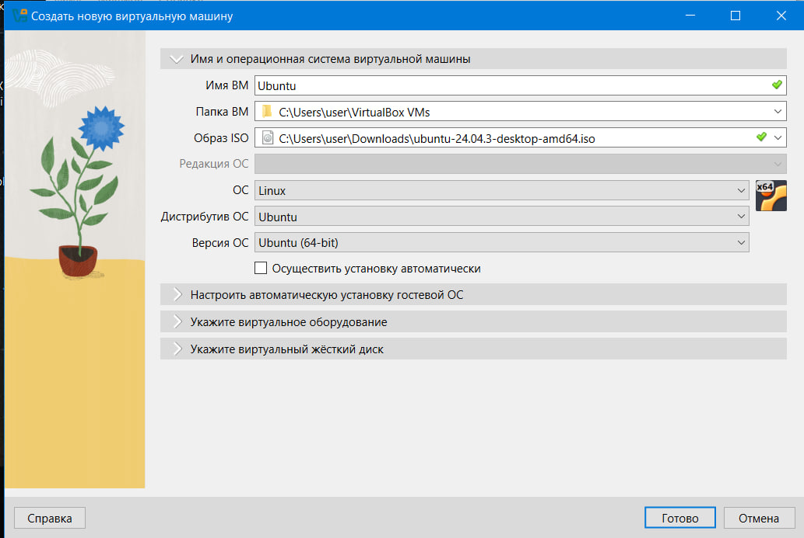
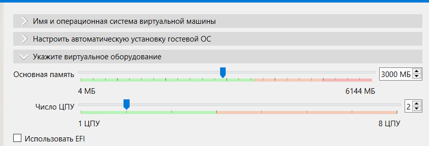
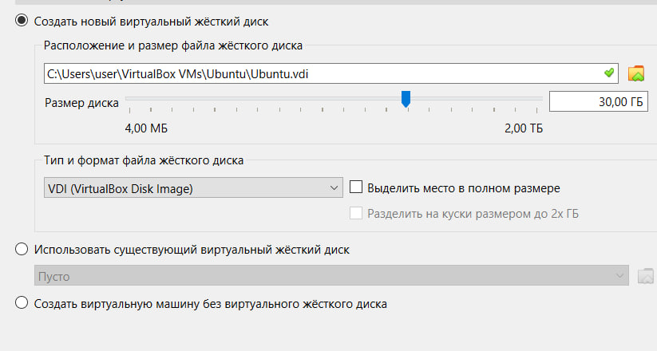
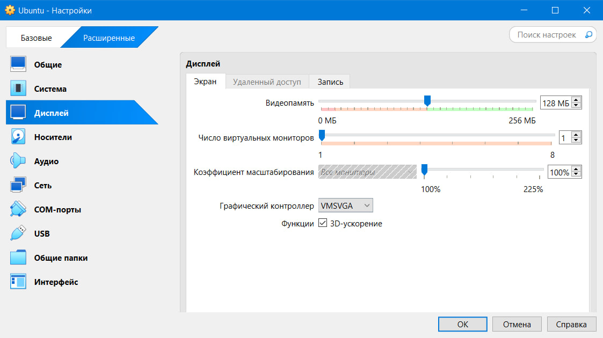
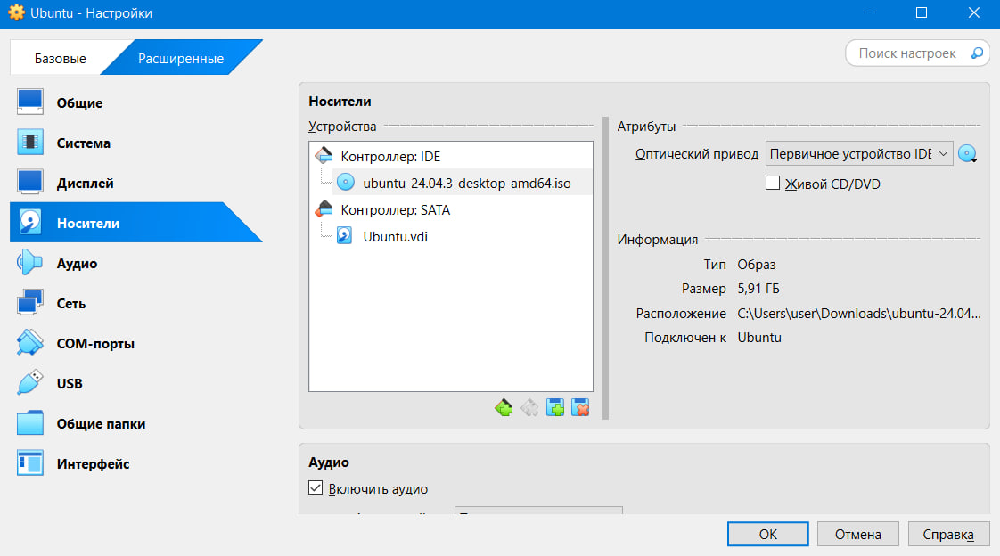
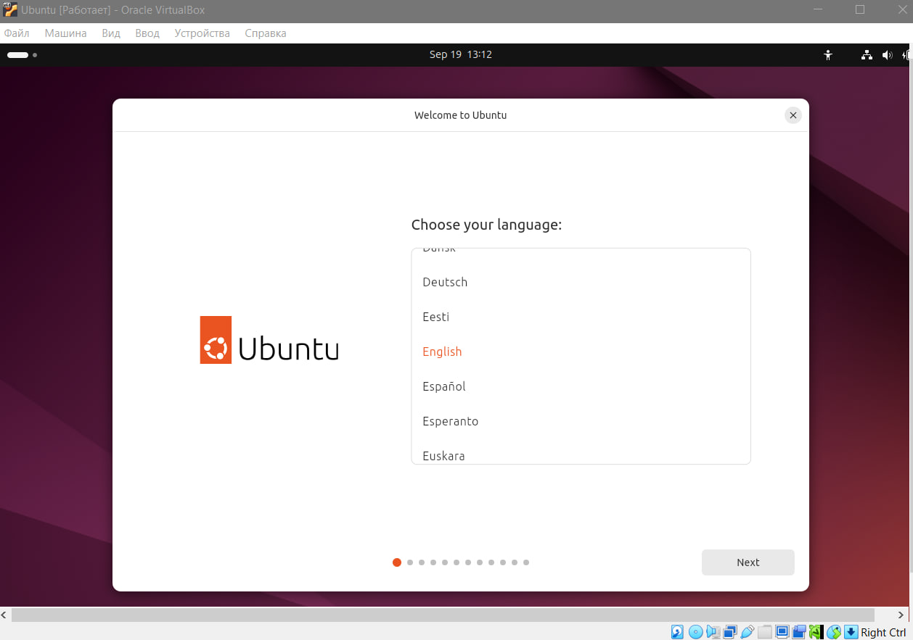
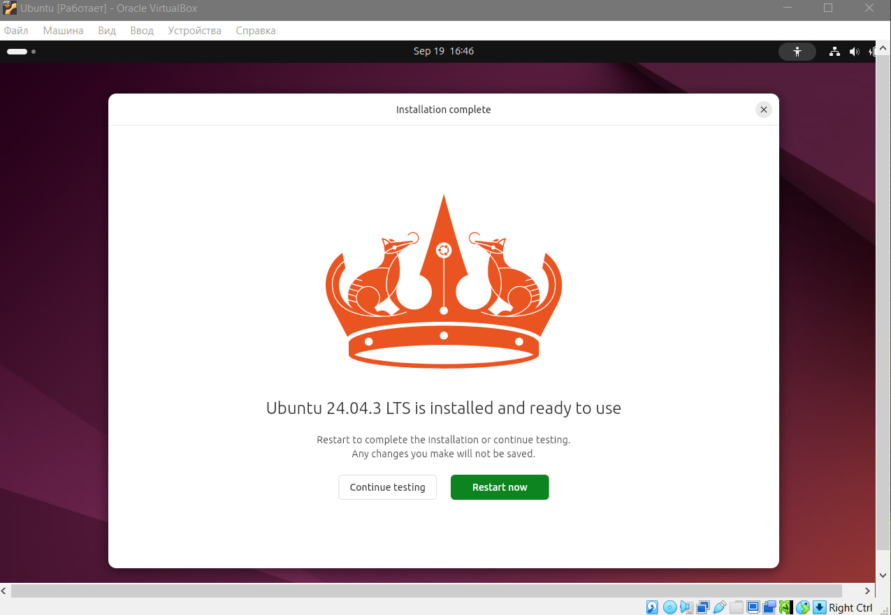
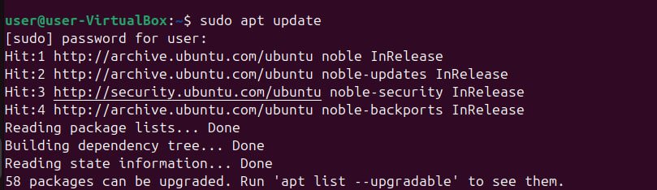
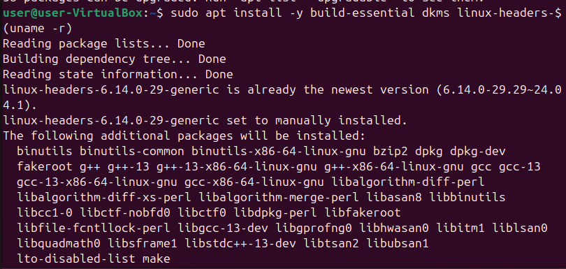
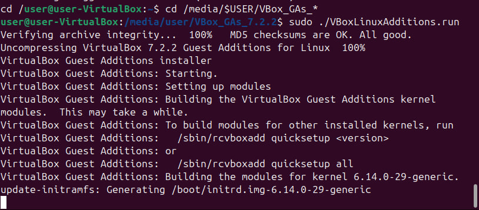

# Лабораторная работа 1 : Установка виртуальной машины и Ubuntu

## Выполнил

* Mihailov Piotr I2302
* Дата выполнения: 19.09.25

## Цель работы

Целью данной лабораторной работы является изучение процесса установки и настройки виртуальной машины с использованием Oracle VM VirtualBox и операционной системы Ubuntu 24.04.3 LTS на компьютере под управлением Windows. В ходе работы будут освоены навыки создания виртуальной машины, настройки аппаратных ресурсов, установки ОС и интеграции гостевых дополнений для улучшения производительности и удобства использования.

## Ход выполнения работы

### Требования

Для выполнения работы были подготовлены следующие ресурсы:

* Оперативная память хоста: не менее 8 ГБ (рекомендуется, чтобы выделить достаточный объем для ВМ).
* Свободное место на диске хоста: не менее 30 ГБ для виртуального диска и ISO-образа.
* ISO-образ Ubuntu 24.04.3 LTS, загруженный с официального сайта [https://ubuntu.com/download/desktop](https://ubuntu.com/download/desktop)

### Установка VirtualBox

1. Загружен установочный файл VirtualBox для Windows с официального сайта [https://www.virtualbox.org/wiki/Downloads](https://www.virtualbox.org/wiki/Downloads).
2. Запущен установщик (.exe), выполнена установка с настройками по умолчанию.
3. Подтверждены предупреждения о сетевых интерфейсах и разрешена установка драйверов.
4. После завершения установки VirtualBox успешно запущен.

### Загрузка ISO-образа Ubuntu

1. Перейдено на сайт [https://ubuntu.com/download/desktop](https://ubuntu.com/download/desktop).
2. Загружен ISO-образ Ubuntu 22.04 LTS.
3. Файл сохранен в локальной директории.

### Создание виртуальной машины

1. В VirtualBox нажата кнопка «Создать» для запуска мастера создания новой ВМ.
2. Указано имя ВМ: Ubuntu.
3. Указан путь к папке ВМ: C:\Users\user\VirtualBox VMs\Ubuntu\.
4. Выбран образ ISO: C:\Users\user\Downloads\ubuntu-24.04.3-desktop-amd64.iso.
5. Тип ОС: Linux.
6. Версия ОС: Ubuntu (64-bit).
7. Не отмечена опция «Осуществить установку автоматически».



8. Выделено оперативной памяти: 3000 МБ (из диапазона 4 МБ – 6144 МБ).
9. Выделено виртуальных процессоров: 1 ЦПУ (из возможных 1–8).
10. Включен режим EFI для совместимости с современными ОС.



11. Создан виртуальный жесткий диск:
    * Расположение: C:\Users\user\VirtualBox VMs\Ubuntu\Ubuntu.vdi.
    * Размер: 30.00 ГБ (из диапазона 4.00 МБ – 2.00 ТБ).
    * Тип: VDI (VirtualBox Disk Image).


### Настройка виртуальной машины

1. В разделе «Система» выделено 2 ядра процессора.
2. В разделе «Дисплей» установлено 128 МБ видеопамяти, включено 3D-ускорение.



3. В разделе «Носители» подключен ISO-образ Ubuntu к оптическому приводу.



### Установка Ubuntu

1. Запущена виртуальная машина.
2. Выбрана опция «Install Ubuntu» и установлен английский язык.



3. Выбрана «Normal installation» с опцией загрузки обновлений во время установки.
4. Установлен тип установки: «Erase disk and install Ubuntu» (для виртуального диска).
5. Настроен часовой пояс и создан пользователь с паролем.
6. После завершения установки выполнен перезапуск системы.



### Установка Guest Additions

1. После загрузки Ubuntu подключен образ дополнений гостевой ОС через меню VirtualBox.
2. Открыт терминал в папке с дополнениями.
3. Выполнены команды:

   ```bash
   sudo apt update
   sudo apt install -y build-essential dkms linux-headers-$(uname -r)
   cd /media/$USER/VBox_GAs_*
   sudo ./VBoxLinuxAdditions.run
   sudo reboot
   ```

 



4. После перезагрузки проверена улучшенная интеграция мыши, буфера обмена и экрана.

## Результаты

В результате выполнения лабораторной работы была успешно установлена и настроена виртуальная машина с операционной системой Ubuntu 22.04 LTS. Установлены дополнения Guest Additions, что обеспечило улучшенную интеграцию с хост-системой. Все этапы выполнены в соответствии с инструкцией, ошибок в процессе установки не возникло.

## Вывод

В ходе лабораторной работы были освоены навыки установки и настройки виртуальной машины с использованием VirtualBox, а также установки операционной системы Ubuntu. Полученные знания могут быть применены для создания изолированных сред для тестирования и разработки программного обеспечения.
