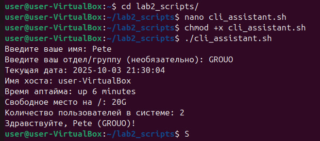
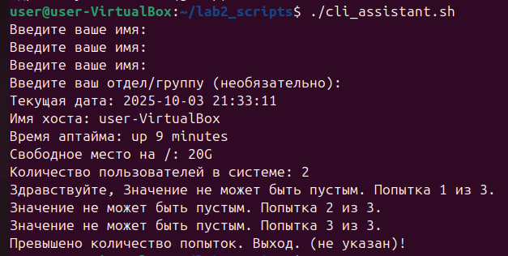
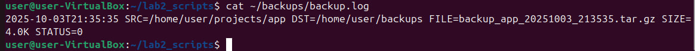
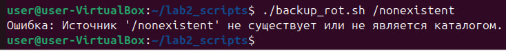
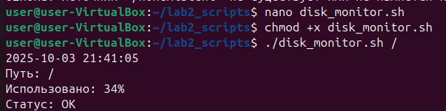

# Лабораторная работа: Разработка CLI-утилит для системного администрирования

## Выполнил

* Mihailov Piotr I2302
* Дата выполнения: 03.10.25

## Цель работы

Целью данной лабораторной работы является освоение основ bash-скриптинга и разработка набора CLI-утилит для автоматизации типичных задач системного администрирования. В ходе работы будут изучены принципы работы с вводом/выводом, валидацией данных, обработкой аргументов командной строки, работой с файловой системой, архивированием данных и мониторингом системных ресурсов. Разработанные скрипты должны соответствовать требованиям безопасности, надёжности и удобства использования.

## Ход выполнения работы

### Требования

Для выполнения работы были подготовлены следующие ресурсы и инструменты:

* Операционная система: Ubuntu 24.04 LTS или совместимый дистрибутив Linux
* Bash версии 4.0 или выше

### Задание 1: CLI-ассистент с валидацией и системным отчётом

#### Описание задачи

Необходимо создать интерактивный скрипт `cli_assistant.sh`, который запрашивает у пользователя имя и отдел с валидацией ввода (максимум 3 попытки), а затем выводит мини-отчёт о текущем состоянии системы.

#### Реализация

Создан файл `cli_assistant.sh` со следующим содержимым:

```bash
#!/bin/bash
# Задание 1: cli_assistant.sh

# Функция для запроса ввода с валидацией и попытками
function get_input {
    local prompt="$1"
    local max_attempts=3
    local attempt=1
    local input=""
    
    while [ $attempt -le $max_attempts ]; do
        read -p "$prompt: " input
        if [ -n "$input" ]; then
            echo "$input"
            return 0
        else
            echo "Значение не может быть пустым. Попытка $attempt из $max_attempts."
            ((attempt++))
        fi
    done
    
    echo "Превышено количество попыток. Выход."
    exit 1
}

# Запрос имени (обязательно)
name=$(get_input "Введите ваше имя")

# Запрос отдела (необязательно)
read -p "Введите ваш отдел/группу (необязательно): " department
if [ -z "$department" ]; then
    department="не указан"
fi

# Мини-отчёт
current_date=$(date +"%Y-%m-%d %H:%M:%S")
hostname=$(hostname)
uptime=$(uptime -p)
free_space=$(df -h / | tail -1 | awk '{print $4}')
logged_users=$(who | wc -l)

echo "Текущая дата: $current_date"
echo "Имя хоста: $hostname"
echo "Время аптайма: $uptime"
echo "Свободное место на /: $free_space"
echo "Количество пользователей в системе: $logged_users"

# Итоговая строка
echo "Здравствуйте, $name ($department)!"
```

#### Ключевые элементы реализации

1. **Функция валидации ввода**: Реализована функция `get_input()` с использованием локальных переменных и цикла `while` для ограничения количества попыток ввода.

2. **Командная подстановка**: Использован синтаксис `$(...)` для встраивания результатов выполнения системных команд в переменные.

3. **Обработка необязательного ввода**: Реализована проверка пустого значения для отдела с установкой значения по умолчанию.

4. **Системная информация**: Собраны данные о дате, хосте, времени работы системы, свободном месте на диске и количестве активных пользователей.

#### Процесс создания и запуска

1. Создан файл скрипта:

```bash
nano cli_assistant.sh
```

2. Вставлен код скрипта, файл сохранён (Ctrl + O, Enter, Ctrl + X).

3. Установлены права на выполнение:

```bash
chmod +x cli_assistant.sh
```

4. Выполнен первый запуск скрипта:

```bash
./cli_assistant.sh
```

#### Тестирование успешного сценария

```bash
$ ./cli_assistant.sh
```



#### Тестирование валидации ввода

Проверка обработки пустого ввода с повторными попытками:

```bash
./cli_assistant.sh
```



### Задание 2: Резервное копирование с логированием и ротацией

#### Описание задачи

Необходимо создать скрипт `backup_rot.sh` для автоматического резервного копирования каталога с созданием tar.gz архива, логированием всех операций и поддержкой настройки путей через аргументы командной строки.

#### Реализация

Создан файл `backup_rot.sh` со следующим содержимым:

```bash
#!/bin/bash
# Задание 2: backup_rot.sh

# Проверка количества аргументов
if [ $# -lt 1 ] || [ $# -gt 2 ]; then
    echo "Использование: $0 <путь_к_источнику> [путь_к_бэкапам]"
    exit 2
fi

src_dir="$1"
backup_dir="${2:-$HOME/backups}"

# Проверка существования источника и что это каталог
if [ ! -d "$src_dir" ]; then
    echo "Ошибка: Источник '$src_dir' не существует или не является каталогом."
    exit 3
fi

# Создание каталога бэкапов если нужно
mkdir -p "$backup_dir" || {
    echo "Ошибка: Не удалось создать каталог бэкапов '$backup_dir'."
    exit 4
}

# Проверка доступности записи в каталог бэкапов
if [ ! -w "$backup_dir" ]; then
    echo "Ошибка: Нет прав на запись в '$backup_dir'."
    exit 5
fi

# Имя архива
basename_src=$(basename "$src_dir")
timestamp=$(date +"%Y%m%d_%H%M%S")
archive_name="backup_${basename_src}_${timestamp}.tar.gz"
archive_path="$backup_dir/$archive_name"

# Создание архива
tar -czf "$archive_path" -C "$(dirname "$src_dir")" "$(basename "$src_dir")" &> /dev/null
status=$?

# Размер архива
if [ $status -eq 0 ]; then
    size=$(du -h "$archive_path" | cut -f1)
else
    size="N/A"
fi

# Логирование
log_file="$backup_dir/backup.log"
log_entry="$(date +"%Y-%m-%dT%H:%M:%S") SRC=$src_dir DST=$backup_dir FILE=$archive_name SIZE=$size STATUS=$status"
echo "$log_entry" >> "$log_file"

# Выход с кодом
exit $status
```

#### Ключевые элементы реализации

1. **Обработка аргументов**: Реализована проверка количества переданных аргументов с поддержкой значения по умолчанию для пути к бэкапам.

2. **Валидация путей**: Выполнены проверки существования исходного каталога, возможности создания каталога бэкапов и прав на запись.

3. **Защита от пробелов**: Все пути заключены в кавычки для корректной обработки имён с пробелами.

4. **Создание архива**: Использована команда `tar` с опцией `-C` для правильной структуры архива без полных путей.

5. **Структурированное логирование**: Создан лог-файл с информацией в формате ISO 8601, содержащий все важные параметры операции.

#### Процесс создания и запуска

1. Создан файл скрипта:

```bash
nano backup_rot.sh
```

2. Вставлен код скрипта, файл сохранён (Ctrl + O, Enter, Ctrl + X).

3. Установлены права на выполнение:

```bash
chmod +x backup_rot.sh
```

4. Подготовлены тестовые данные:

```bash
mkdir -p ~/projects/app
echo "Test file" > ~/projects/app/test.txt
```

#### Тестирование с одним аргументом

Запуск с использованием пути бэкапов по умолчанию (`~/backups`):

```bash
cat ~/backups/backup.log
```



#### Тестирование обработки ошибок

**Несуществующий источник:**

```bash
./backup_rot.sh /nonexistent
```



### Задание 3: Мониторинг дискового пространства

#### Описание задачи

Необходимо создать скрипт `disk_monitor.sh` для мониторинга использования дискового пространства с настраиваемым порогом предупреждения и информативным выводом состояния файловой системы.

#### Реализация

Создан файл `disk_monitor.sh` со следующим содержимым:

```bash
#!/bin/bash
# Задание 3: disk_monitor.sh

# Проверка количества аргументов
if [ $# -lt 1 ] || [ $# -gt 2 ]; then
    echo "Использование: $0 <путь> [порог_в_процентах]"
    exit 2
fi

path="$1"
threshold="${2:-80}"

# Проверка существования пути
if [ ! -d "$path" ]; then
    echo "Ошибка: Путь '$path' не существует."
    exit 2
fi

# Получение процента использования
usage_line=$(df -h "$path" | tail -1)
usage_percent=$(echo "$usage_line" | awk '{print $5}' | tr -d '%')

# Текущая дата/время
current_datetime=$(date +"%Y-%m-%d %H:%M:%S")

# Вывод
echo "$current_datetime"
echo "Путь: $path"
echo "Использовано: ${usage_percent}%"

if [ "$usage_percent" -lt "$threshold" ]; then
    echo "Статус: OK"
    exit 0
else
    echo "Статус: WARNING: диск почти заполнен!"
    exit 1
fi
```

#### Ключевые элементы реализации

1. **Получение данных о диске**: Использована команда `df -h` в комбинации с `awk` и `tr` для извлечения процента использования.

2. **Числовое сравнение**: Применён оператор `-lt` (less than) для корректного числового сравнения.

3. **Настраиваемый порог**: Реализована поддержка пользовательского порога с значением по умолчанию 80%.

4. **Информативный вывод**: Формат вывода включает дату, путь, процент использования и статус.

5. **Коды возврата**: Различные коды возврата позволяют легко интегрировать скрипт в системы мониторинга.

#### Процесс создания и запуска

1. Создан файл скрипта:

```bash
nano disk_monitor.sh
```

2. Вставлен код скрипта, файл сохранён (Ctrl + O, Enter, Ctrl + X).

3. Установлены права на выполнение:

```bash
chmod +x disk_monitor.sh
```

#### Тестирование с одним аргументом

Запуск с порогом по умолчанию (80%):

```bash
./disk_monitor.sh /
```



## Результаты

В результате выполнения лабораторной работы были успешно разработаны три полнофункциональных bash-скрипта:

1. **cli_assistant.sh** — интерактивный CLI-ассистент с валидацией ввода и генерацией системного отчёта. Скрипт корректно обрабатывает пользовательский ввод, ограничивает количество попыток и собирает актуальную информацию о состоянии системы.

2. **backup_rot.sh** — система резервного копирования с поддержкой настраиваемых путей, структурированным логированием и полной обработкой ошибок. Скрипт создаёт архивы с временными метками, проверяет права доступа и ведёт подробный лог всех операций.

3. **disk_monitor.sh** — утилита мониторинга дискового пространства с настраиваемыми порогами предупреждений. Скрипт корректно определяет процент использования, сравнивает с пороговым значением и возвращает соответствующие коды статуса.

Все скрипты прошли успешное тестирование в различных сценариях использования, включая обработку ошибочных входных данных. Реализованы все требования по безопасности (кавычирование переменных), надёжности (проверка кодов возврата) и удобству использования (информативные сообщения об ошибках).

## Вывод

В ходе выполнения лабораторной работы были освоены ключевые навыки bash-скриптинга:

* Работа с переменными, условными операторами и циклами
* Валидация пользовательского ввода и аргументов командной строки
* Командная подстановка с использованием синтаксиса `$()`
* Работа с файловой системой (проверка путей, создание каталогов, архивация)
* Структурированное логирование операций
* Обработка ошибок и возврат корректных статус-кодов
* Защита от специальных символов в путях (пробелы, спецсимволы)

Разработанные скрипты могут быть использованы для автоматизации рутинных задач системного администрирования, интегрированы в системы мониторинга или служить основой для более сложных решений. Полученные знания применимы для создания надёжных и безопасных bash-скриптов для продакшн-окружений.

Особую ценность представляет опыт работы с обработкой ошибок и возвратом статус-кодов, что позволяет создавать скрипты, легко интегрируемые в автоматизированные процессы и системы оркестрации.

## Библиография

1. Advanced Bash-Scripting Guide by Mendel Cooper: [https://tldp.org/LDP/abs/html/](https://tldp.org/LDP/abs/html/) — исчерпывающее руководство по продвинутому bash-скриптингу
2. GNU Bash Manual: [https://www.gnu.org/software/bash/manual/](https://www.gnu.org/software/bash/manual/) — официальная документация по Bash
3. Linux Command Line and Shell Scripting Bible by Richard Blum and Christine Bresnahan — комплексное руководство по работе с командной строкой
4. Bash Best Practices: [https://bertvv.github.io/cheat-sheets/Bash.html](https://bertvv.github.io/cheat-sheets/Bash.html) — лучшие практики написания bash-скриптов
5. ShellCheck: [https://www.shellcheck.net/](https://www.shellcheck.net/) — инструмент для статического анализа shell-скриптов
6. The Linux Documentation Project: [https://tldp.org/](https://tldp.org/) — обширная база знаний по Linux и скриптингу