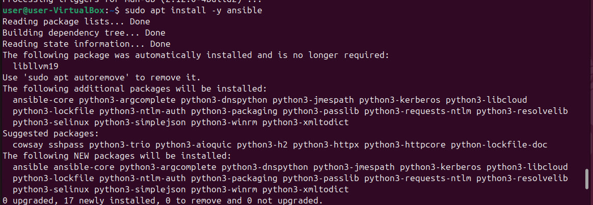
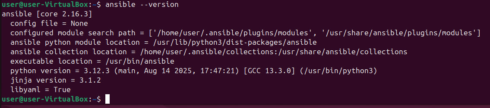
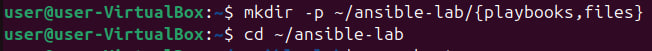
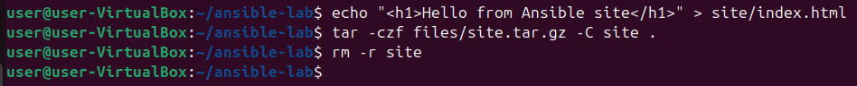
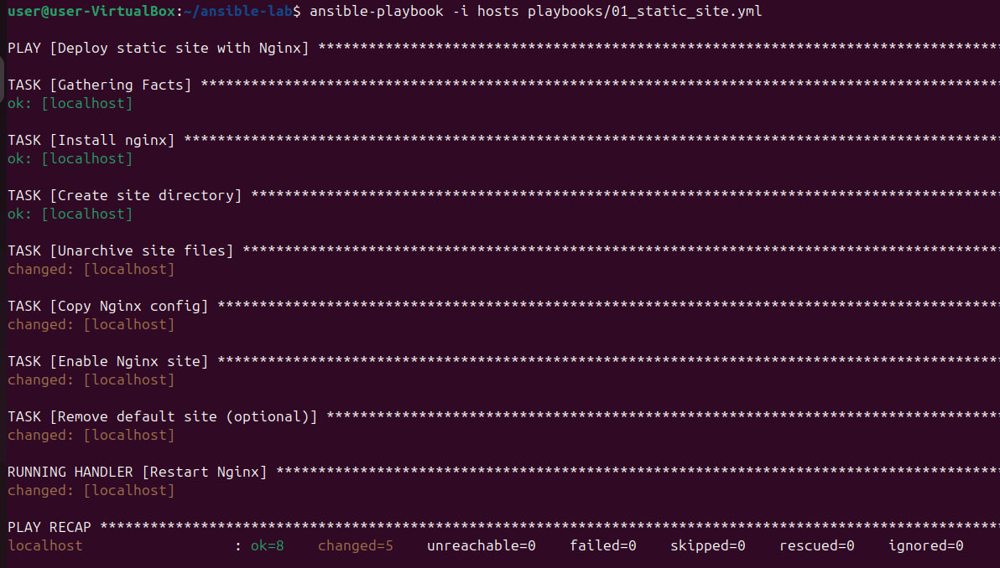
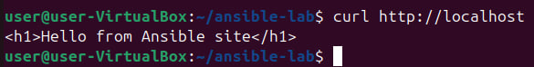
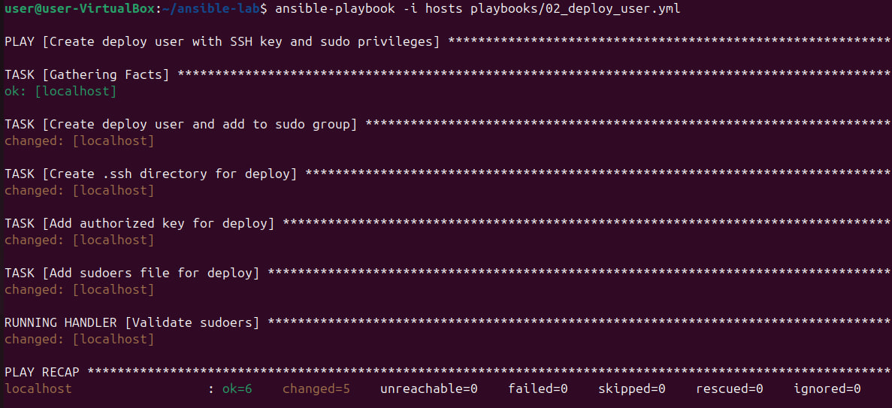
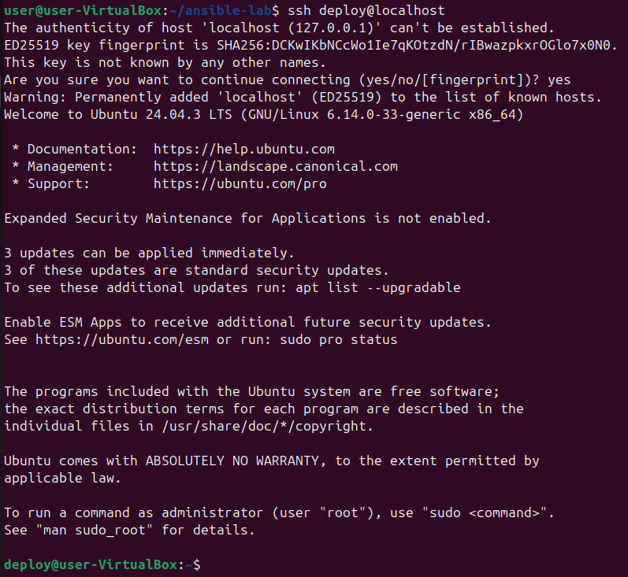
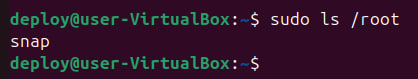

# Лабораторная работа 3: Автоматизация системного администрирования с помощью Ansible

**Выполнил:** Mihailov Piotr, I2302

**Дата выполнения:** 23.10.2025

## Цель работы

Целью данной лабораторной работы является освоение практической автоматизации задач системного администрирования с использованием Ansible. В ходе выполнения работы были разработаны два плейбука: первый обеспечивает развертывание статического веб-сайта через Nginx с распаковкой архива, второй создает пользователя `deploy`, настраивает вход по SSH-ключу и предоставляет права `sudo` без ввода пароля.

## Требования к среде

* Виртуальная машина Ubuntu (VirtualBox)
* Ansible
* OpenSSH Server
* Nginx

## Ход выполнения

### Задание 1: Развёртывание статического сайта через Nginx

**Описание задачи:**
Необходимо автоматизировать развертывание статического сайта. Плейбук должен:

1. Установить Nginx.
2. Создать каталог `/var/www/mysite`.
3. Распаковать архив сайта.
4. Скопировать конфигурацию виртуального хоста.
5. Активировать сайт и перезапустить Nginx.

**Структура проекта на данном этапе:**

Данная структура проекта организована таким образом, чтобы обеспечить удобство при работе с Ansible.  

- Файл `hosts` выполняет роль инвентори и указывает, на какие хосты будет выполняться плейбук (в данном случае — локальный хост).  
- Директория `playbooks/` содержит основной сценарий автоматизации (`01_static_site.yml`).  
- Папка `files/` используется для хранения вспомогательных файлов, таких как архив с сайтом (`site.tar.gz`) и конфигурация виртуального хоста Nginx (`mysite.conf`).  
Такое разделение позволяет структурировано организовать автоматизацию и упростить повторное использование плейбуков.

```bash
ansible-lab/
├── hosts
├── playbooks/
│   └── 01_static_site.yml
└── files/
    ├── site.tar.gz
    └── mysite.conf
```

**Этап 1. Подготовка окружения:**

На данном этапе выполняется установка необходимого инструмента — Ansible, который используется как средство автоматизации системного администрирования. 

- Команда `sudo apt update` обновляет списки пакетов, чтобы система могла установить актуальную версию программ.  
- Команда `sudo apt install -y ansible` выполняет автоматическую установку Ansible без запроса подтверждения.  
- Далее `ansible --version` позволяет убедиться, что установка прошла успешно, и отображает установленную версию.

```bash
sudo apt update
sudo apt install -y ansible
ansible --version
```





**Этап 2. Создание структуры проекта:**

```bash
mkdir -p ~/ansible-lab/{playbooks,files}
cd ~/ansible-lab
```



**Этап 3. Создание файла `hosts`:**

Файл `hosts` играет роль инвентори (inventory) — он содержит список хостов, на которые Ansible будет выполнять задачи.  
- В данном случае создается группа `local`, в которую добавлен единственный хост — `localhost`, то есть текущая машина.  
- Параметр `ansible_connection=local` указывает, что подключение к хосту будет выполняться локально, без использования SSH.

Таким образом, Ansible будет выполнять все действия непосредственно на этой машине.

```ini
[local]
localhost ansible_connection=local
```

**Этап 4. Создание архива сайта:**

На данном этапе подготавливается архив с содержимым будущего статического сайта, который позже будет развернут с помощью Ansible. 

- Команда `mkdir site` создаёт временную директорию для размещения файлов сайта.  
- С помощью `echo "<h1>Hello from Ansible site!</h1>" > site/index.html` создаётся простой HTML-файл, который будет отображаться при открытии сайта.  
- Команда `tar -czf files/site.tar.gz -C site .` архивирует содержимое каталога `site` в формате `.tar.gz` и сохраняет его в папку `files` — именно этот архив будет развернут плейбуком.  
- После архивации директория `site` удаляется (`rm -r site`), так как она больше не требуется.

Таким образом, на выходе получается готовый архив для автоматического развертывания веб-сайта.

```bash
mkdir site
echo "<h1>Hello from Ansible site!</h1>" > site/index.html
tar -czf files/site.tar.gz -C site .
rm -r site
```



**Этап 5. Конфигурационный файл Nginx `mysite.conf`:**

Файл `mysite.conf` содержит конфигурацию виртуального хоста для веб-сервера Nginx. Он определяет, как сервер должен обрабатывать запросы к сайту.

```conf
server {
    listen 80;
    listen [::]:80;
    server_name _;
    root /var/www/mysite;
    index index.html;
    access_log /var/log/nginx/mysite_access.log;
    error_log /var/log/nginx/mysite_error.log;
    location / {
        try_files $uri $uri/ =404;
    }
}
```

**Этап 6. Плейбук `01_static_site.yml`:**
Этот плейбук устанавливает Nginx, создаёт директорию сайта, разворачивает архив и применяет конфигурацию хоста.

```yaml
---
- name: Deploy static site with Nginx
  hosts: local
  become: yes
  vars:
    site_dir: /var/www/mysite
    site_archive: /home/user/ansible-lab/files/site.tar.gz
    nginx_conf_src: /home/user/ansible-lab/files/mysite.conf
  tasks:
    - name: Install nginx
      apt:
        name: nginx
        state: present
        update_cache: yes
    - name: Create site directory
      file:
        path: "{{ site_dir }}"
        state: directory
        mode: '0755'
    - name: Unarchive site files
      unarchive:
        src: "{{ site_archive }}"
        dest: "{{ site_dir }}"
        remote_src: yes
    - name: Copy Nginx config
      copy:
        src: "{{ nginx_conf_src }}"
        dest: /etc/nginx/sites-available/mysite.conf
    - name: Enable Nginx site
      file:
        src: /etc/nginx/sites-available/mysite.conf
        dest: /etc/nginx/sites-enabled/mysite.conf
        state: link
        force: yes
      notify: Restart Nginx
    - name: Remove default site (optional)
      file:
        path: /etc/nginx/sites-enabled/default
        state: absent
      notify: Restart Nginx
  handlers:
    - name: Restart Nginx
      service:
        name: nginx
        state: restarted
```

**Запуск плейбука:**

```bash
ansible-playbook -i hosts playbooks/01_static_site.yml
```



**Проверка работы сайта:**

```bash
curl http://localhost
```



Также проверка в браузере


**Вывод по заданию 1:**
Создание сайта полностью автоматизировано. Запуск одного плейбука заменяет установку, настройку и запуск Nginx вручную.

### Задание 2: Создание пользователя deploy и настройка SSH-доступа

Перед созданием пользователя необходимо убедиться, что в системе установлен и запущен SSH-сервер, чтобы можно было выполнять удалённый вход по ключу. Установка выполнялась командой:

`sudo apt install -y openssh-server`

После установки SSH-сервер был запущен автоматически, что позволило настроить доступ через плейбук.

**Описание задачи:**
Необходимо создать пользователя `deploy`, обеспечить ему доступ по SSH-ключу и предоставить права `sudo` без пароля.

**Плейбук `02_deploy_user.yml`:**

```yaml
---
- name: Create deploy user with SSH key and sudo privileges
  hosts: local
  become: yes
  vars:
    deploy_user: deploy
    sudoers_file: /etc/sudoers.d/deploy
    ssh_key_src: /home/user/ansible-lab/files/deploy_key.pub
  tasks:
    - name: Create deploy user and add to sudo group
      user:
        name: "{{ deploy_user }}"
        groups: sudo
        shell: /bin/bash
        create_home: yes
        state: present
    - name: Create .ssh directory for deploy
      file:
        path: "/home/{{ deploy_user }}/.ssh"
        state: directory
        mode: '0700'
        owner: "{{ deploy_user }}"
        group: "{{ deploy_user }}"
    - name: Add authorized key for deploy
      authorized_key:
        user: "{{ deploy_user }}"
        key: "{{ lookup('file', ssh_key_src) }}"
    - name: Add sudoers file for deploy
      copy:
        content: "{{ deploy_user }} ALL=(ALL) NOPASSWD:ALL"
        dest: "{{ sudoers_file }}"
        mode: '0440'
      notify: Validate sudoers
  handlers:
    - name: Validate sudoers
      command: visudo -cf "{{ sudoers_file }}"
```

**Запуск плейбука:**

```bash
ansible-playbook -i hosts playbooks/02_deploy_user.yml
```



**Проверка SSH:**

```bash
ssh deploy@localhost
sudo ls /root
```





Команда `ssh deploy@localhost` подтверждает успешный вход по SSH от имени пользователя `deploy`, при этом доступ осуществляется по добавленному ранее ключу, без запроса пароля.  
Далее команда `sudo ls /root` демонстрирует, что пользователь может выполнять команды от имени суперпользователя без ввода пароля.  

В результате выводится содержимое каталога `/root`, где отображается, например, директория `snap`.  
`snap` — это системный каталог, используемый для установки и хранения приложений в формате Snap-пакетов. Появление этого каталога подтверждает, что пользователю доступен просмотр системных директорий, требующих прав `sudo`.

**Вывод по заданию 2:**
Создание пользователя, настройка входа по ключу и выдача sudo-прав была полностью автоматизирована.

## Вывод вывод

В ходе выполнения лабораторной работы я освоил использование Ansible для автоматизации системного администрирования. Были созданы два плейбука: первый позволил автоматически развернуть статический сайт с помощью Nginx, включая установку сервера, создание директории, распаковку архива и активацию конфигурации. Второй плейбук автоматизировал создание пользователя `deploy`, настройку входа по SSH-ключу и предоставление sudo-привилегий без запроса пароля. В процессе работы я понял, как Ansible использует модули для выполнения конкретных задач и как важно структурировать проект для удобного управления. Полученные навыки подтверждают, что автоматизация позволяет ускорить развертывание, минимизировать ошибки и обеспечивает повторяемость конфигураций