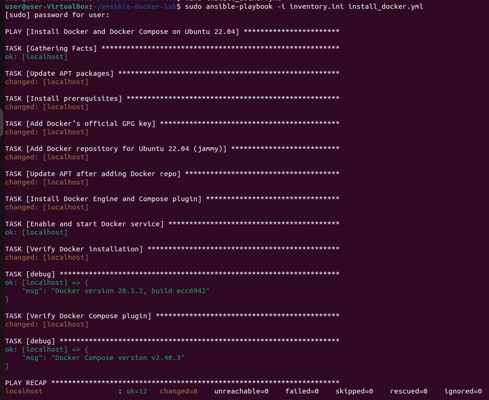
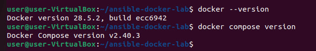
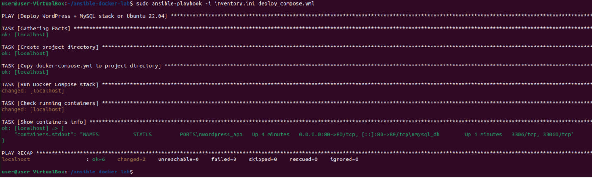
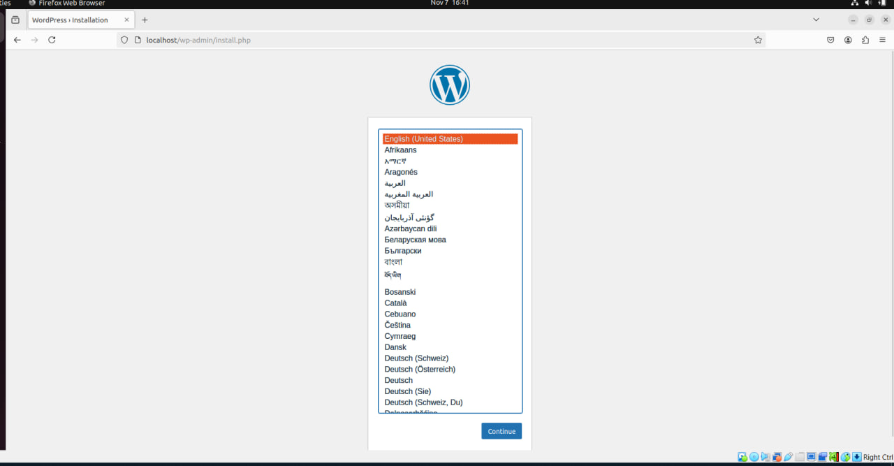

# Лабораторная работа 4

## Автоматизация развертывания многоконтейнерного приложения с Docker Compose с использованием Ansible

**Выполнил:** Mihailov Piotr, I2302

**Дата выполнения:** 07.11.2025

---

## Цель работы

Целью данной лабораторной работы является освоение инструментов Ansible и Docker Compose для автоматизации установки и развертывания многоконтейнерных приложений. В процессе выполнения работы были разработаны и протестированы сценарии автоматизации, позволяющие автоматически устанавливать Docker, копировать и запускать многоконтейнерное приложение WordPress + MySQL.

---

## Требования к среде

* Виртуальная машина Ubuntu 22.04 (VirtualBox)
* Ansible
* Docker Engine и Docker Compose Plugin
* Интернет-доступ для загрузки Docker-образов

---

## Ход выполнения

### Этап 1. Подготовка окружения и установка Ansible

На первом этапе выполняется установка Ansible, который используется для автоматизации всех операций.

**Команды:**

```bash
sudo apt update
sudo apt install -y ansible
ansible --version
```

После установки можно убедиться в корректной работе Ansible при помощи команды `ansible --version`.

---

### Этап 2. Создание структуры проекта

Создадим рабочую директорию для проекта и необходимые файлы:

```bash
mkdir -p ~/ansible-docker-lab
cd ~/ansible-docker-lab
```

**Структура проекта:**

```bash
ansible-docker-lab/
├── inventory.ini
├── install_docker.yml
├── docker-compose.yml
└── deploy_compose.yml
```

---

### Этап 3. Настройка файла inventory.ini

Файл `inventory.ini` выполняет роль инвентори и определяет, на какие хосты Ansible будет выполнять команды. В данной лабораторной используется локальная машина, поэтому указываем:

```ini
[docker_hosts]
localhost ansible_connection=local
```

Параметр `ansible_connection=local` сообщает, что все команды будут выполняться локально без подключения по SSH.

---

### Этап 4. Установка Docker и Docker Compose

Для установки Docker создается плейбук `install_docker.yml`, который автоматизирует добавление репозитория, установку пакетов и запуск сервиса Docker.

```yaml
---
- name: Install Docker and Docker Compose on Ubuntu 22.04
  hosts: docker_hosts
  become: yes
  tasks:
    - name: Update APT packages
      apt:
        update_cache: yes

    - name: Install prerequisites
      apt:
        name:
          - apt-transport-https
          - ca-certificates
          - curl
          - gnupg
          - lsb-release
        state: present

    - name: Add Docker’s official GPG key
      shell: |
        install -m 0755 -d /etc/apt/keyrings
        curl -fsSL https://download.docker.com/linux/ubuntu/gpg | gpg --dearmor -o /etc/apt/keyrings/docker.gpg
        chmod a+r /etc/apt/keyrings/docker.gpg
      args:
        creates: /etc/apt/keyrings/docker.gpg

    - name: Add Docker repository for Ubuntu 22.04 (jammy)
      copy:
        dest: /etc/apt/sources.list.d/docker.list
        content: |
          deb [arch=amd64 signed-by=/etc/apt/keyrings/docker.gpg] https://download.docker.com/linux/ubuntu jammy stable

    - name: Update APT after adding Docker repo
      apt:
        update_cache: yes

    - name: Install Docker Engine and Compose plugin
      apt:
        name:
          - docker-ce
          - docker-ce-cli
          - containerd.io
          - docker-compose-plugin
        state: present

    - name: Enable and start Docker service
      systemd:
        name: docker
        enabled: yes
        state: started

    - name: Verify Docker installation
      command: docker --version
      register: docker_v
    - debug:
        msg: "{{ docker_v.stdout }}"

    - name: Verify Docker Compose plugin
      command: docker compose version
      register: compose_v
      ignore_errors: yes
    - debug:
        msg: "{{ compose_v.stdout | default('docker compose not found') }}"
```

**Запуск плейбука:**

```bash
sudo ansible-playbook -i inventory.ini install_docker.yml
```



После выполнения Docker и Compose установлены и готовы к использованию.



---

### Этап 5. Создание файла docker-compose.yml

На данном этапе создается файл `docker-compose.yml`, который описывает структуру многоконтейнерного приложения WordPress + MySQL.

```yaml
version: '3.9'

services:
  db:
    image: mysql:8.0
    container_name: mysql_db
    restart: always
    environment:
      MYSQL_ROOT_PASSWORD: root
      MYSQL_DATABASE: wordpress
      MYSQL_USER: wp_user
      MYSQL_PASSWORD: wp_pass
    volumes:
      - db_data:/var/lib/mysql

  wordpress:
    image: wordpress:latest
    container_name: wordpress_app
    restart: always
    ports:
      - "80:80"
    environment:
      WORDPRESS_DB_HOST: db:3306
      WORDPRESS_DB_USER: wp_user
      WORDPRESS_DB_PASSWORD: wp_pass
      WORDPRESS_DB_NAME: wordpress
    depends_on:
      - db

volumes:
  db_data:
```

Файл описывает два контейнера: базу данных MySQL и CMS WordPress, связывая их в одну сеть и создавая общий том для хранения данных.

---

### Этап 6. Развертывание приложения через Ansible

Теперь создаем плейбук `deploy_compose.yml`, который копирует Compose-файл на сервер и запускает контейнеры.

```yaml
---
- name: Deploy WordPress + MySQL stack on Ubuntu 22.04
  hosts: docker_hosts
  become: yes
  vars:
    project_dir: /opt/wp-compose

  tasks:
    - name: Create project directory
      file:
        path: "{{ project_dir }}"
        state: directory
        mode: '0755'

    - name: Copy docker-compose.yml to project directory
      copy:
        src: docker-compose.yml
        dest: "{{ project_dir }}/docker-compose.yml"

    - name: Run Docker Compose stack
      shell: docker compose -f {{ project_dir }}/docker-compose.yml up -d
      args:
        chdir: "{{ project_dir }}"

    - name: Check running containers
      shell: docker ps --format "table {{'{{'}}.Names{{'}}'}}\t{{'{{'}}.Status{{'}}'}}\t{{'{{'}}.Ports{{'}}'}}"
      register: containers
      args:
        executable: /bin/bash

    - name: Show containers info
      debug:
        var: containers.stdout
```

**Запуск:**

```bash
sudo ansible-playbook -i inventory.ini deploy_compose.yml
```



### Этап 7. Проверка работы приложения

Проверим, что контейнеры действительно работают:
Откроем сайт в браузере по адресу:

```site
http://localhost
```

Появляется страница установки WordPress.



---

## Вывод

В ходе лабораторной работы были изучены принципы автоматизации установки и развертывания приложений с помощью Ansible и Docker Compose. Разработанные плейбуки позволяют автоматически установить Docker, скопировать и запустить многоконтейнерное приложение WordPress + MySQL. Все задачи выполнены успешно, цель работы достигнута.
