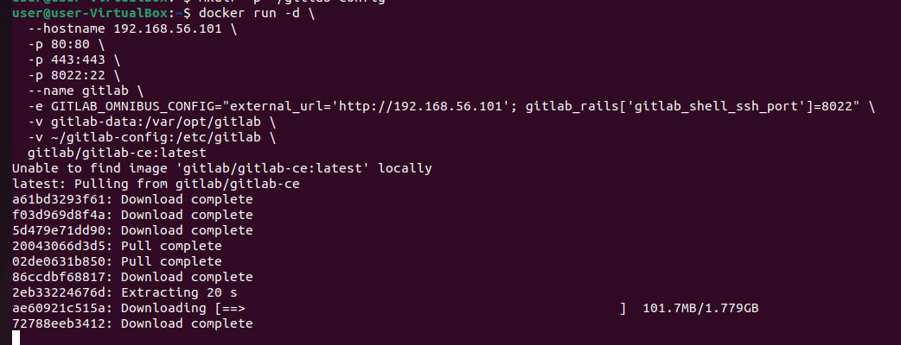
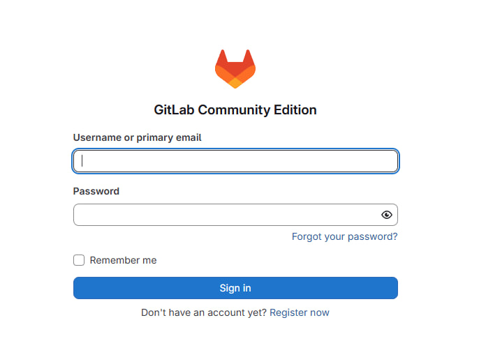
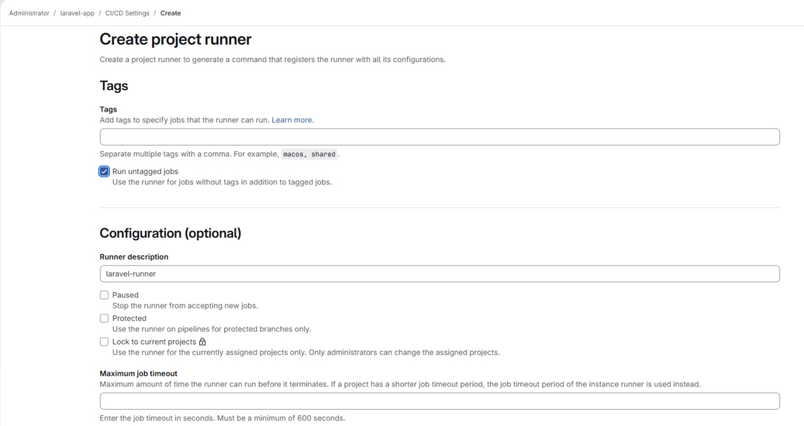
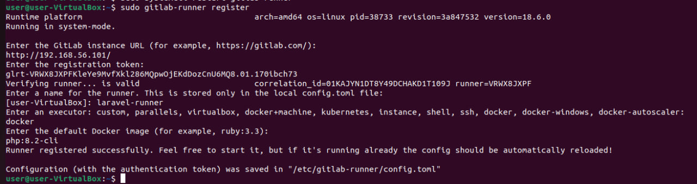
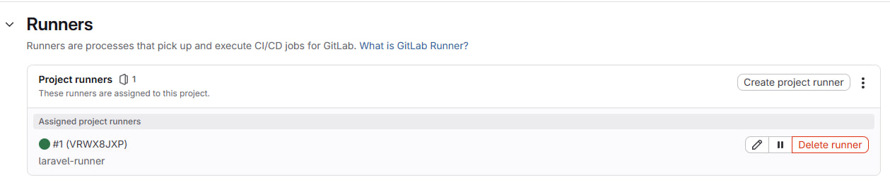
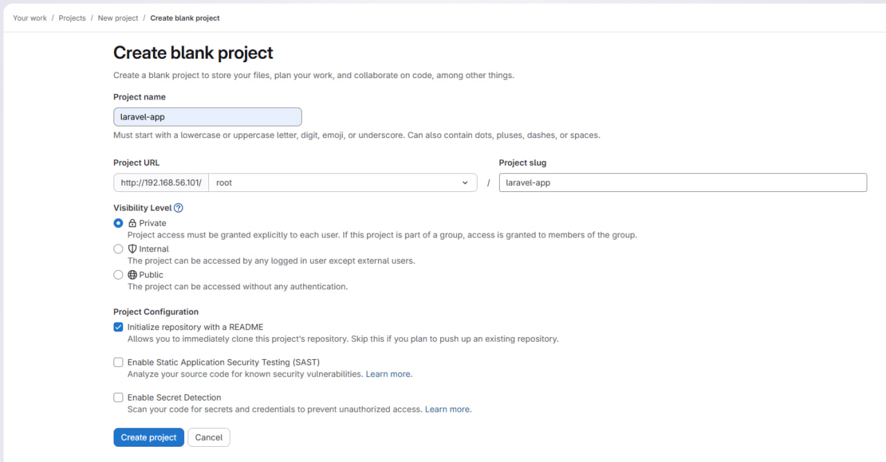
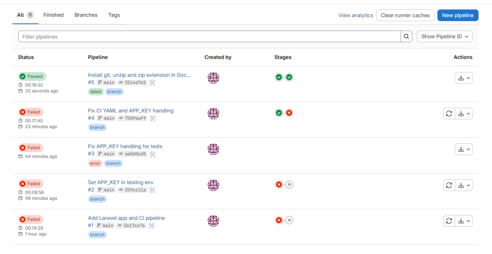

# Лабораторная работа. Расширенный пайплайн GitLab CI для Laravel

**Тема:** Настройка GitLab CE и расширенного CI-пайплайна для Laravel-приложения

**Выполнил:** Mihailov Piotr, I2302

## 1. Цель работы

Целью работы было развернуть собственный сервер CI/CD на базе **GitLab Community Edition** и реализовать конвейер для Laravel-приложения, который:

* автоматически запускает модульные и функциональные тесты (PHPUnit);
* собирает Docker-образ приложения на основе Dockerfile;
* сохраняет собранный образ в **GitLab Container Registry** проекта.

Все действия выполнялись по шагам, указанным в задании, на собственной виртуальной машине.

## 2. Описание используемой среды

* Хост-система: **Windows 10**.
* Виртуальная машина: **Ubuntu Server 22.04** в VirtualBox.

  * Выделено: 4 ГБ ОЗУ, 2 виртуальных ядра.
* Сетевые адаптеры VirtualBox:

  * **Адаптер 1 – NAT** (для доступа ВМ в интернет: установка пакетов, загрузка образов Docker и т. д.).
  * **Адаптер 2 – Host-Only** (для доступа к GitLab с хостовой машины по локальному IP).
* IP-адрес ВМ по Host-Only интерфейсу:

```bash
ip a
# ...
3: enp0s8: ...
    inet 192.168.56.101/24 brd 192.168.56.255 scope global noprefixroute enp0s8
```

* Контейнер GitLab CE: образ `gitlab/gitlab-ce:latest`.
* GitLab Runner: установлен как системный сервис на той же ВМ, executor `docker`.
* Приложение: шаблонный проект **Laravel** (последняя версия с GitHub).

Доступ к GitLab с хоста осуществлялся по адресу `http://192.168.56.101:8080`.

## 3. Развертывание GitLab CE в Docker

### 3.1. Запуск контейнера GitLab CE

На виртуальной машине был установлен Docker и выполнен запуск контейнера с GitLab CE:

```bash
docker run -d \
  --hostname 192.168.56.101 \
  -p 8080:80 \
  -p 8443:443 \
  -p 8022:22 \
  --name gitlab \
  -e GITLAB_OMNIBUS_CONFIG="external_url='http://192.168.56.101:8080'; gitlab_rails['gitlab_shell_ssh_port']=8022" \
  -v gitlab-data:/var/opt/gitlab \
  -v ~/gitlab-config:/etc/gitlab \
  gitlab/gitlab-ce:latest
```



Здесь:

* `external_url` указывает на адрес, по которому GitLab будет доступен из браузера.
* Порты 8080/8443/8022 проброшены с контейнера на ВМ для HTTP, HTTPS и SSH.
* Том `gitlab-data` хранит данные GitLab (репозитории, БД и т. д.), `~/gitlab-config` — конфигурацию.

### 3.2. Ожидание готовности GitLab

После запуска контейнера были просмотрены логи до полной инициализации:

```bash
docker logs -f gitlab
```

Ожидалось появление информационного сообщения о том, что GitLab готов к работе.

### 3.3. Получение пароля root и первый вход

Первоначальный пароль пользователя `root` был получен командой:

```bash
docker exec -it gitlab cat /etc/gitlab/initial_root_password
```

Затем в браузере на хосте был открыт адрес:

```text
http://192.168.56.101:8080
```

Выполнен вход под пользователем `root`



## 4. Установка и настройка GitLab Runner

GitLab по умолчанию не содержит встроенных Runner'ов, поэтому их необходимо установить и зарегистрировать отдельно.

### 4.1. Установка GitLab Runner

На виртуальной машине Ubuntu был установлен GitLab Runner из официальнего репозитория:

```bash
curl -L "https://packages.gitlab.com/install/repositories/runner/gitlab-runner/script.deb.sh" | sudo bash
sudo apt-get install -y gitlab-runner
```

После установки Runner доступен как системный сервис.

### 4.2. Создание instance runner в GitLab

В веб-интерфейсе GitLab были выполнены следующие действия:

1. Открыт раздел **Admin Area → CI/CD → Runners**.
2. Нажата кнопка **New instance runner**.
3. Выбрана платформа **Linux**, тип использования: запуск job'ов через **docker**.
4. Заполнено поле **Description** значением `laravel-runner`.
5. Отмечен флаг **Run untagged jobs**, чтобы Runner обрабатывал задания без специальных тегов.
6. Сохранён выданный GitLab **Authentication token** формата `glrt-...`.



### 4.3. Регистрация Runner на ВМ

На ВМ был зарегистрирован Runner с использованием полученного токена:

```bash
gitlab-runner register \
  --url "http://192.168.56.101:8080" \
  --token "<TOKEN_ИЗ_GITLAB>" \
  --executor "docker" \
  --docker-image "php:8.2-cli" \
  --description "laravel-runner"
```



После регистрации Runner был запущен и добавлен в автозагрузку, состояние проверено командой:

```bash
sudo gitlab-runner status
```

В админском разделе GitLab (**Admin Area → CI/CD → Runners**) Runner отобразился как **Online**.



## 5. Создание проекта и подготовка Laravel-приложения

### 5.1. Создание пустого проекта в GitLab

В веб-интерфейсе GitLab был создан новый проект:

* **Название:** `laravel-app`
* Тип: **Create blank project**

URL репозитория проекта:

```text
http://192.168.56.101:8080/root/laravel-app.git
```



### 5.2. Клонирование репозитория и загрузка Laravel

На ВМ были выполнены следующие действия:

```bash
cd ~
# Клонирование пустого проекта GitLab
git clone http://192.168.56.101:8080/root/laravel-app.git

# Загрузка шаблонного проекта Laravel из GitHub
git clone https://github.com/laravel/laravel.git

# Копирование содержимого Laravel в репозиторий GitLab
cp -r ~/laravel/* ~/laravel-app/
cd ~/laravel-app
```

После копирования в проекте `laravel-app` оказались все стандартные файлы Laravel: `composer.json`, `artisan`, директории `app/`, `config/`, `database/`, `routes/`, `tests/`, `public/` и др.

### 5.3. Создание `Dockerfile` для Laravel

В корне проекта был создан файл `Dockerfile` для сборки Docker-образа с Laravel и Apache:

```dockerfile
FROM php:8.2-apache

RUN apt-get update && apt-get install -y \
    libpng-dev libonig-dev libxml2-dev libzip-dev unzip git \
    && docker-php-ext-install pdo_mysql mbstring exif pcntl bcmath zip

COPY --from=composer:latest /usr/bin/composer /usr/bin/composer

WORKDIR /var/www/html
COPY . /var/www/html

RUN composer install --no-scripts --no-interaction
RUN chown -R www-data:www-data storage bootstrap/cache
RUN chmod -R 775 storage

RUN a2enmod rewrite
EXPOSE 80

CMD ["apache2-foreground"]
```

Во время отладки был исправлен важный момент: без пакетов `git`, `unzip` и PHP-расширения `zip` команда `composer install` внутри контейнера завершалась с ошибкой. После добавления этих пакетов сборка стала проходить успешно.

### 5.4. Настройка файла `.env.testing`

Для разграничения рабочего и тестового окружения был создан файл `.env.testing` со следующими основными параметрами:

```env
APP_NAME=Laravel
APP_ENV=testing
APP_KEY=
APP_DEBUG=true
APP_URL=http://localhost

DB_CONNECTION=mysql
DB_HOST=mysql
DB_PORT=3306
DB_DATABASE=laravel_test
DB_USERNAME=root
DB_PASSWORD=root

SESSION_DRIVER=database
SESSION_LIFETIME=120
FILESYSTEM_DISK=local
QUEUE_CONNECTION=database
CACHE_STORE=database
MAIL_MAILER=log
MAIL_HOST=127.0.0.1
MAIL_PORT=2525
MAIL_FROM_ADDRESS="hello@example.com"
MAIL_FROM_NAME="${APP_NAME}"
```

`APP_KEY` оставлен пустым, так как ключ шифрования генерируется автоматически в процессе CI перед запуском тестов.

### 5.5. Подготовка тестов

В папке `tests/Feature` был использован стандартный тест `ExampleTest`. Дополнительно в `tests/Unit/ExampleTest.php` добавлен простой unit-тест для демонстрации работы PHPUnit:

```php
<?php

namespace Tests\Unit;

use PHPUnit\Framework\TestCase;

class ExampleTest extends TestCase
{
    public function test_basic_test(): void
    {
        $this->assertTrue(true);
    }
}
```

## 6. Настройка `.gitlab-ci.yml` и пайплайна

### 6.1. Начальная версия `.gitlab-ci.yml`

Изначально в корне проекта был создан файл `.gitlab-ci.yml` со стадиями `test` и `build` и использованием сервиса MySQL:

```yaml
stages:
  - test
  - build

services:
  - mysql:8.0

variables:
  MYSQL_DATABASE: laravel_test
  MYSQL_ROOT_PASSWORD: root
  DB_HOST: mysql

before_script:
  - apt-get update -yqq
  - apt-get install -yqq libpng-dev libonig-dev libxml2-dev libzip-dev unzip git
  - docker-php-ext-install pdo_mysql mbstring exif pcntl bcmath
  - curl -sS https://getcomposer.org/installer | php -- --install-dir=/usr/local/bin --filename=composer
  - composer install --no-scripts --no-interaction
  - cp .env.testing .env
  - php artisan key:generate
  - php artisan migrate --seed
  - php artisan config:clear

unit_tests:
  stage: test
  image: php:8.2-cli
  script:
    - vendor/bin/phpunit
  after_script:
    - rm -f .env
```

На этой стадии пайплайн запускался, но некоторое время тесты падали с ошибками, связанными с `APP_KEY` (отсутствие ключа шифрования или неверная длина). Эти проблемы были устранены за счёт правильного порядка действий в `before_script`.

### 6.2. Итоговая версия пайплайна

После отладки файл `.gitlab-ci.yml` был приведён к рабочему виду с двумя стадиями:

* `test` — установка зависимостей, подготовка окружения, миграции и запуск PHPUnit;
* `build` — сборка Docker-образа и отправка его в Container Registry.

Итоговый вариант

```yaml
stages:
  - test
  - build

services:
  - mysql:8.0

variables:
  MYSQL_DATABASE: laravel_test
  MYSQL_ROOT_PASSWORD: root
  DB_HOST: mysql

cache:
  paths:
    - vendor/

.test_template: &test_template
  image: php:8.2-cli
  before_script:
    - apt-get update -yqq
    - apt-get install -yqq libpng-dev libonig-dev libxml2-dev libzip-dev unzip git
    - docker-php-ext-install pdo_mysql mbstring exif pcntl bcmath zip
    - curl -sS https://getcomposer.org/installer | php -- --install-dir=/usr/local/bin --filename=composer
    - composer install --no-scripts --no-interaction
    - cp .env.testing .env
    - php artisan key:generate
    - sleep 25
    - php artisan migrate --seed
    - php artisan config:clear

unit_tests:
  <<: *test_template
  stage: test
  script:
    - vendor/bin/phpunit

build_image:
  stage: build
  image: docker:26
  services:
    - docker:26-dind
  variables:
    DOCKER_TLS_CERTDIR: ""
  before_script:
    - echo "$CI_REGISTRY_PASSWORD" | docker login -u "$CI_REGISTRY_USER" --password-stdin "$CI_REGISTRY"
  script:
    - docker build -t "$CI_REGISTRY_IMAGE:latest" .
    - docker push "$CI_REGISTRY_IMAGE:latest"
```

Таким образом, в первой стадии поднимается сервис `mysql:8.0`, устанавливаются PHP-зависимости, выполняются миграции и запускаются тесты. Во второй стадии используется `docker:dind` для сборки и отправки образа в реестр GitLab.

## 7. Запуск и проверка конвейера

После добавления всех файлов в репозиторий были выполнены стандартные команды:

```bash
git status
git add .
git commit -m "Add Laravel app and CI pipeline"
git push
```

Веб-интерфейс GitLab автоматически запустил пайплайн. Проверка состояния выполнялась в разделе:

```text
CI/CD → Pipelines
```

В логах job `unit_tests` было видно:

* успешную установку зависимостей через `composer install`;
* применение миграций `php artisan migrate --seed`;
* запуск PHPUnit и прохождение тестов без ошибок.

В job `build_image`:

* успешный вход в реестр GitLab через переменные `CI_REGISTRY_USER` и `CI_REGISTRY_PASSWORD`;
* успешный `docker build` по Dockerfile проекта;
* успешный `docker push` образа с тегом `latest` в реестр.

Оба job'а завершились со статусом **success**, весь пайплайн имеет состояние **Passed**.



## 8. Итоговая проверка Container Registry

Заключительным шагом по заданию было убедиться, что собранный Docker-образ доступен в реестре образов GitLab.

Для этого в проекте `laravel-app` был открыт раздел:

```text
Packages & Registries → Container Registry
```

Внутри появился репозиторий образов проекта, в котором отображается загруженный Docker-образ с тегом `latest`. Это подтверждает, что:

* пайплайн не только собирает образ,
* но и корректно публикует его в **GitLab Container Registry**.

## 9. Выводы

В процессе выполнения лабораторной работы было реализовано следующее:

1. Развёрнут GitLab CE в контейнере Docker на виртуальной машине с Ubuntu 22.04, настроена сетевая схема NAT + Host-Only и доступ к интерфейсу GitLab по адресу `http://192.168.56.101:8080`.
2. Установлен и зарегистрирован GitLab Runner с типом executor `docker`, обеспечен запуск CI job'ов из пайплайна.
3. Создан проект `laravel-app`, в репозиторий загружен шаблон Laravel-приложения, добавлены Dockerfile, `.env.testing` и тесты.
4. Настроен файл `.gitlab-ci.yml`, описывающий конвейер из двух стадий: `test` (подготовка окружения, миграции и запуск PHPUnit) и `build` (сборка Docker-образа и его отправка в реестр).
5. Пайплайн был отлажен до состояния, когда обе стадии стабильно завершаются успешно.
6. В результате Docker-образ Laravel-приложения появился в **GitLab Container Registry** проекта, что полностью соответствует требованиям задания и демонстрирует корректную интеграцию GitLab CI с Docker и контейнерным реестром.

Таким образом, цель лабораторной работы достигнута: на базе собственного GitLab CE развёрнут и настроен расширенный CI-пайплайн для Laravel-приложения с автоматическим тестированием и сборкой Docker-образа.
