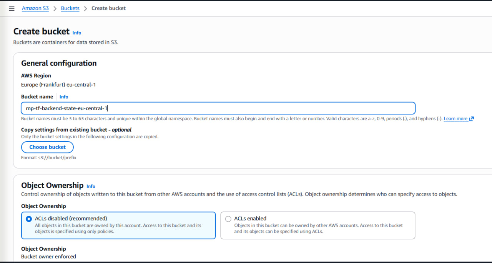
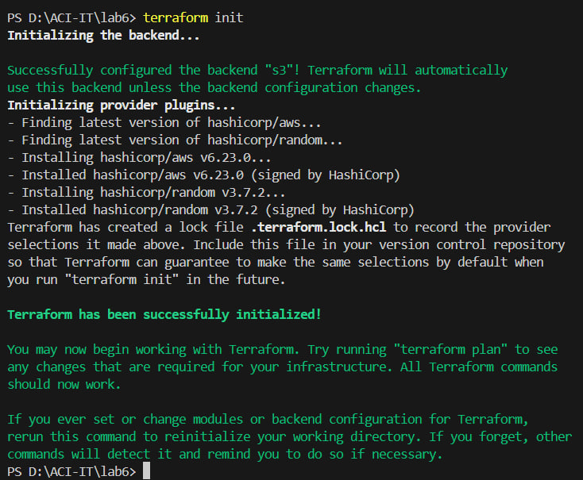
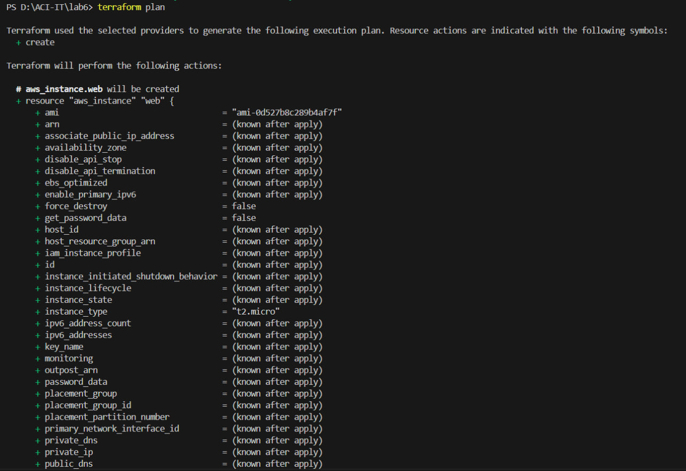
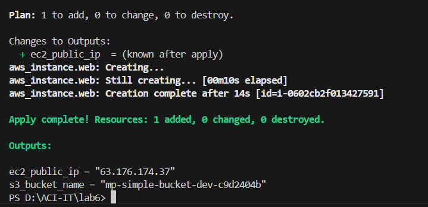
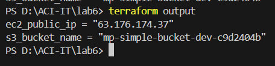
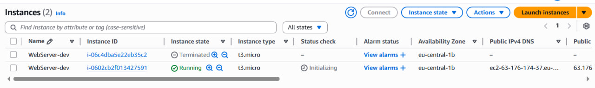
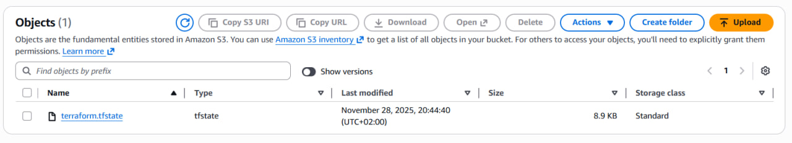

# Лабораторная работа: Развёртывание EC2 и S3 на AWS с Terraform

**Автор:** Mihailov Piotr

---

## Введение

В данной лабораторной работе была выполнена полная автоматизация развёртывания небольшой инфраструктуры в AWS с помощью Terraform. В рамках задания создаётся виртуальный сервер EC2, приватный S3-бакет, а состояние Terraform переносится в удалённый backend на базе S3. Работа включает в себя настройку провайдера AWS, подготовку конфигурационных файлов Terraform, выполнение команд инфраструктурного цикла, а также проверку созданных ресурсов через AWS Console.

Terraform позволяет управлять инфраструктурой декларативно, описывая желаемое состояние в виде кода. Такой подход обеспечивает повторяемость, удобство развёртывания и прозрачность конфигурации. Лабораторная работа демонстрирует на практике принципы Infrastructure as Code.

---

## Цели работы

* Освоить основные принципы работы с Terraform.
* Развернуть EC2-инстанс Amazon Linux 2.
* Создать приватный S3-бакет для тестового хранения.
* Настроить удалённое хранение состояния Terraform в S3.
* Применить переменные и выходные данные.
* Научиться читать план изменений и понимать структуру ресурсов.
* Выполнить полный цикл: init → plan → apply → проверка → destroy.

---

## Подготовка окружения

### Установка Terraform

Была установлена версия Terraform 1.0+, что обеспечивает совместимость со всеми используемыми ресурсами. Проверка выполнялась командой:

```cmd
terraform -version
```

## Создание backend S3-бакета под Terraform state

Перед написанием конфигурации в консоли AWS был создан бакет для хранения состояния:

```
mp-tf-backend-state-eu-central-1
```

Этот бакет не управляется Terraform и создаётся вручную.



Backend позволяет хранить текущее состояние инфраструктуры и обеспечивает совместимость между разными рабочими станциями.

---

## Структура файлов Terraform

В рабочей директории были созданы четыре файла:

* `main.tf` — основной файл с ресурсами.
* `variables.tf` — переменные.
* `outputs.tf` — выходные данные.
* `terraform.tfvars` — конкретные значения переменных.

Такой подход обеспечивает чистоту и прозрачность конфигурации.

---

## Содержимое файлов проекта

### main.tf

Основной файл отвечает за конфигурацию провайдера, backend и ресурсы.

```
terraform {
  backend "s3" {
    bucket  = "mp-tf-backend-state-eu-central-1"
    key     = "terraform.tfstate"
    region  = "eu-central-1"
    encrypt = true
  }
}

provider "aws" {
  region = var.aws_region
}

resource "random_id" "rand" {
  byte_length = 4
}

resource "aws_instance" "web" {
  ami           = "ami-0d527b8c289b4af7f"
  instance_type = "t3.micro"
  tags = {
    Name = "WebServer-${var.env}"
  }
}

resource "aws_s3_bucket" "bucket" {
  bucket = "mp-simple-bucket-${var.env}-${random_id.rand.hex}"
}
```

### variables.tf

```
variable "aws_region" { default = "eu-central-1" }
variable "env"        { default = "dev" }
```

### outputs.tf

```
output "ec2_public_ip" { value = aws_instance.web.public_ip }
output "s3_bucket_name" { value = aws_s3_bucket.bucket.bucket }
```

### terraform.tfvars

```
aws_region = "eu-central-1"
env        = "dev"
```

---

## Выполнение команд Terraform

### Инициализация

```bash
terraform init
```



### Просмотр плана

```bash
terraform plan
```



### Применение плана

```bash
terraform apply -auto-approve
```



Результаты были успешно созданы.

### Проверка выходных данных

```bash
terraform output
```



---

## Проверка результатов в AWS Console

### EC2

Был создан EC2-инстанс `WebServer-dev`.



### S3-бакет проекта


### Terraform state в backend



---

## Завершение работы

После завершения проверки инфраструктура была удалена:

```
terraform destroy -auto-approve
```

Это полностью уничтожило EC2-инстанс и S3-бакет проекта, оставив лишь backend.

---

## Общие выводы

В результате лабораторной работы была развернута и протестирована простая инфраструктура AWS с использованием Terraform. Работа включает в себя ключевые концепции DevOps и IaC.

Удалось освоить:

* работу с провайдерами;
* настройку backend;
* развёртывание EC2;
* создание S3-бакета;
* генерацию уникальных имён;
* использование переменных;
* использование outputs;
* анализ плана и удаление ресурсов.

Terraform показал себя как мощный инструмент, позволяющий быстро и воспроизводимо развёртывать инфраструктуру. Данная работа служит фундаментом для дальнейших лабораторных, включающих сети, роли IAM, базы данных и сложные архитектуры.
